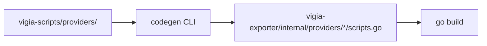

# Pipeline de codegen scripts.go

## Fluxo



## Entrada: manifest YAML

```yaml
# vigia-scripts/providers/sqlserver/sessions/blocking/manifest.yaml
id: sqlserver.sessions.blocking
provider: sqlserver
category: sessions
name: Blocking Chain
sql_file: blocking.sql
severity_default: critical
tier: open
```

## Comando codegen

```bash
cd vigia-scripts
go run ./cmd/codegen \
  --provider sqlserver \
  --output ../vigia-exporter/internal/providers/sqlserver/scripts.go
```

## Template de saída

```go
// Code generated by vigia-scripts v0.1.0. DO NOT EDIT.

package sqlserver

// Scripts contém queries de monitoramento para SQL Server.
var Scripts = map[string]string{
    "sqlserver.sessions.blocking": `SELECT ...`,
}
```

## CI

1. PR em `vigia-scripts` roda testes SQL em containers
2. Artefato `scripts.bundle.json` publicado no registry privado
3. `vigia-exporter` CI baixa bundle e roda codegen antes do build
4. Check `git diff --exit-code` garante sincronização

## Legado DbaMonitor

O antigo fluxo usava tabela `ScriptOffline` em SQL Server + `create-script/main.go`.
Substituir por manifests YAML versionados em Git — **não** depender de DB central.

Migração:

1. Exportar `ScriptOffline` para YAML
2. Deprecar `cmd/deploy/create-script`
3. Remover dependência de `DbaMonitor` database
